# Informe de la actividad
Práctica que permite conocer más en profundidad las clases e interfaces genéricas del lenguaje TypeScript. Además, se practicará con los principios SOLID de diseño orientado a objetos.

## Ejercicio 1 - El combate definitivo
El objetivo de este ejercicio es, a partir del ejercicio 1 de la práctica 5, añadir una clase abstracta Fighters que sirva de guía pra crear clases de distintos univeros. Y actualizar las clases para que funcionen para cada universo.

### Estructura
Para el siguiente ejercicio se preparó la clase abstracta **Fighters** con todos los métodos privadosque antiguamente teniamos en la clase **Pokemon** y se crearon clases para los universos **Pokemon**, **DragonBall**, **Marvel**, **DC** y **Starwars**. Además de modificar la clase **Pokedex** para que ahora reconozca personajes de clase **Fighters**, se creo con la intención de respetar los principios SOLID, una clase **PrintPokedex** que se encarga simplemente de visualizar la Pokedex. En cuanto a la clase **Combat** se han añadido más condiciones en el método **eficacia** para distinguir situaciones dependiendo del universo.

### Código
#### Clase Fighters
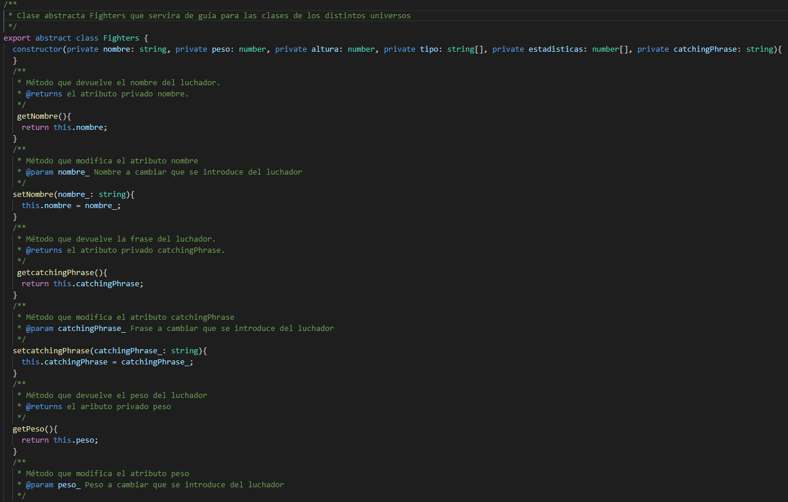

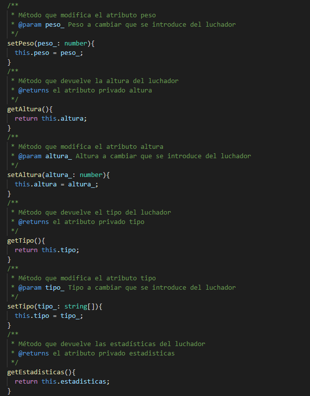

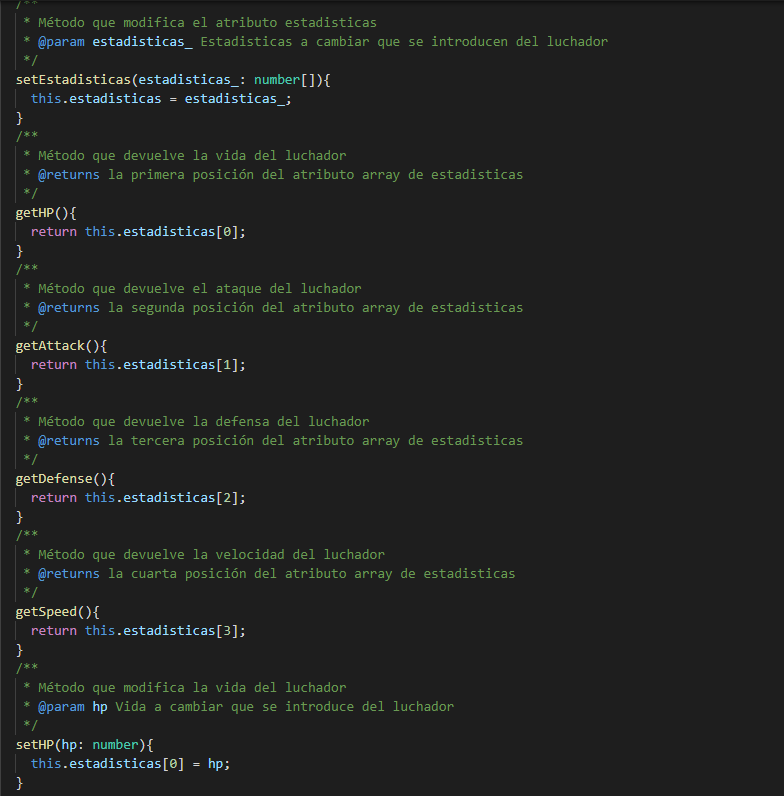

La clase **Fighters** tiene los siguientes atributos privados:
* **nombre** almacena el nombre del luchador.
* **peso** almacena el peso del luchador.
* **altura** almacena la altura del luchador.
* **tipo** almacena como array de string el tipo de un luchador.
* **estadisticas** almacena como array de number la vida, el ataque, la defensa y la velocidad del luchador.

Además de los **get** y **set** de cada atributo, también se añadieron los **get** y **set** para las estadisticas vida, ataque, defensa y velocidad.

#### Clases de los distintos universos
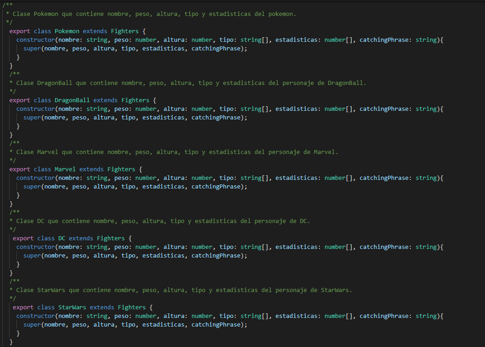

Estas clases son heredadas de la clase abstracta **Fighters**.

#### Clase Pokedex

La clase **Pokedex** tiene como atributo privado **pokemons**, que corresponde con un array del tipo de clase **Fighters**.
Los tres métodos que contiene la clase son:
* **getPokemon** para devolver un luchador en concreto de el array **pokemons**.
* **getNumberOfPokemons** para devolver el tamaño del array **pokemons** y asi saber cuantos luchadores hay en la Pokedex.

#### Clase PrintPokedex
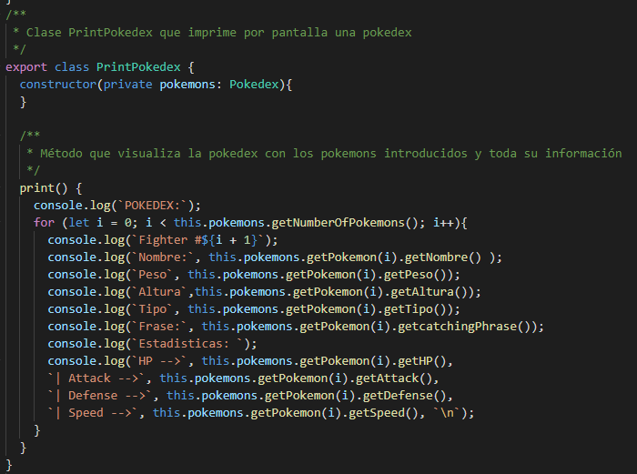

Esta clase contiene el método **print** para visualizar la información de los luchadores.

El método **print** realiza un bucle **for** llamando al método **getNumberOfPokemons** y asi realizar tantas iteraciones como luchadores en la Pokedex. En dicho bucle, se va llamando en cada iteración al método **getPokemon** y al método **get** de cada atributo y estadistica de la clase **Fighters**.

#### Clase Combat
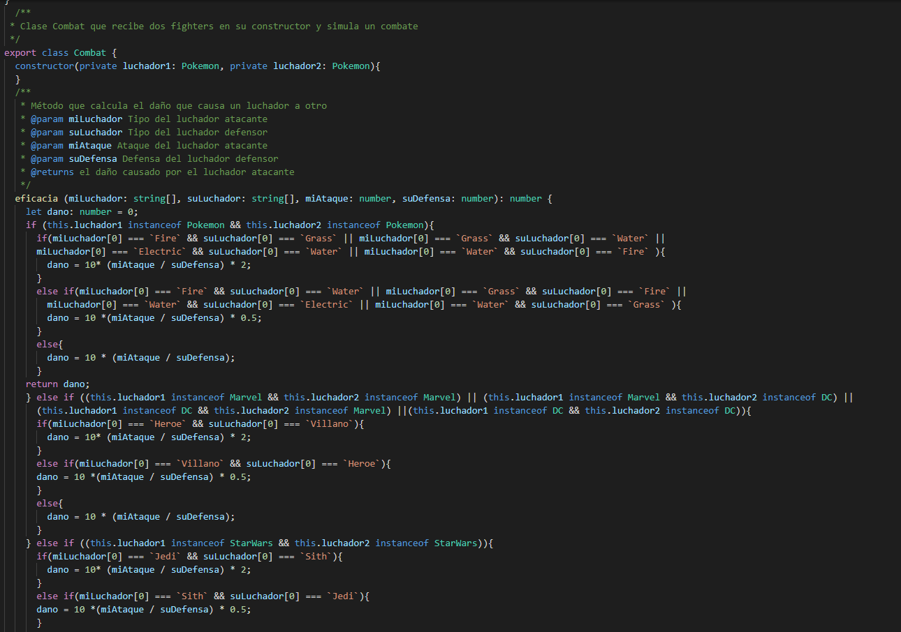
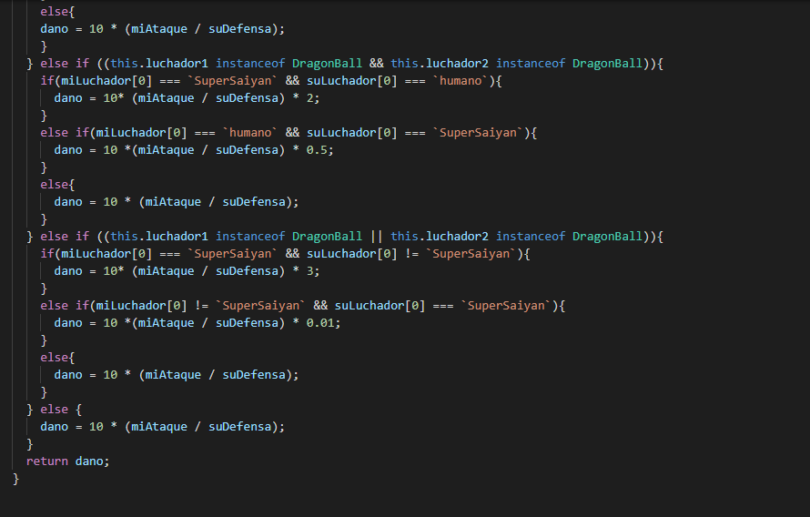
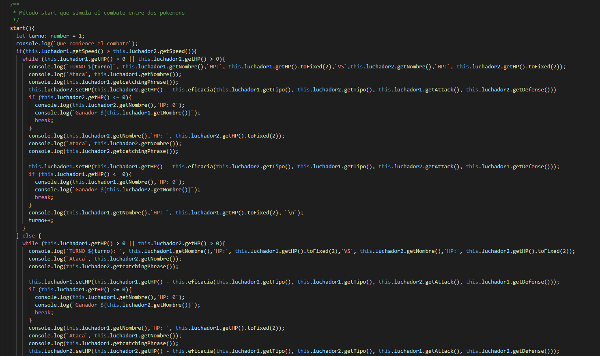

La clase **Combat** sigue siendo igual que en el ejercicio anterior, con la diferencia en el método **eficacia**, en el que se incluyen mas condicionales, y dependiendo de si el objeto es una clase u otra, tome un condicional u otro. Por ejemplo, si ambos objetos son de la clase **Marvel** entran en un condicional y dependiendo de si son heroes o villanos tienen un daño distinto.

#### Objetos y llamadas a métodos

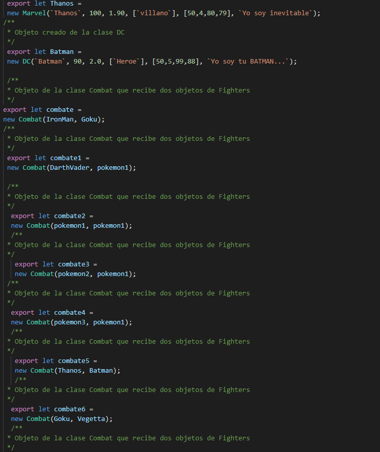

Para el cumplimiento más exhaustivo de la herramienta **Coveralls**, se crearon muchos objetos con la intención de cubrir la mayor cantidad de código.

### Resultados
#### Resultado Pokedex
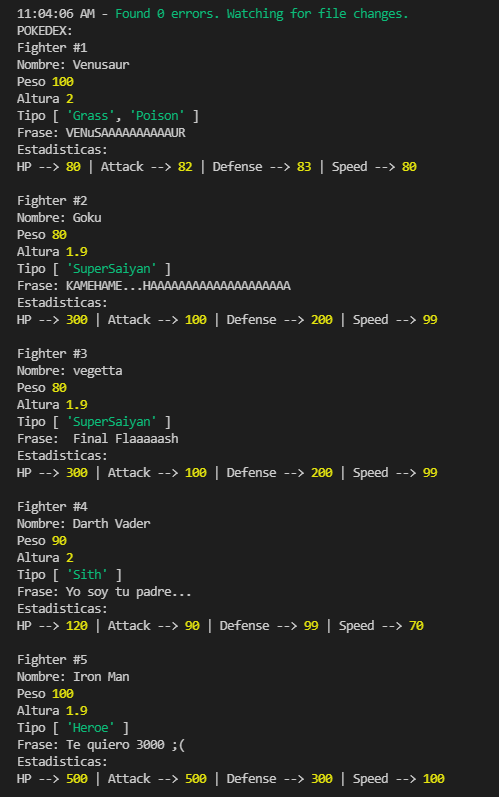

#### Resultado Combate

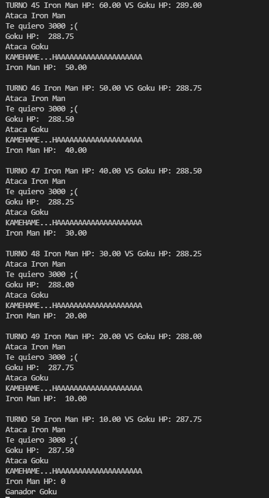

### Test Unitario

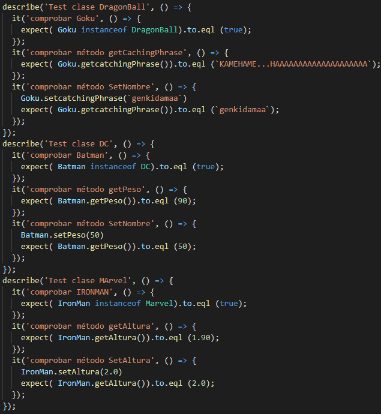

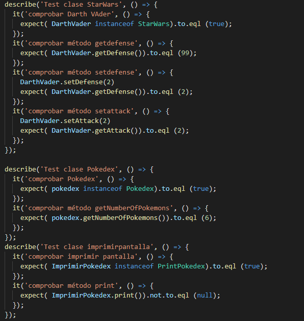

Test donde se ha llevado a cabo comprobaciones para todas las clases y todos los métodos intentando cubrir la mayor cantidad de código.

### Demostración Test Unitario

## Ejercicio 3 - El cifrado indescifrable

El objetivo de este ejercicio es cifrar y descifrar mensajes a partir de un alfabeto y una clave.

### Estructura

Para la estructura de este ejercicio se ha optado por crear 3 clases:
* **Mensaje** clase con el objetivo de crear un mensaje y tener metodos **Set** y **get** al respecto.
* **Clave** clase con el objetivo de crear una clave y tener metodos **Set** y **get** al respecto.
* **Cifrado** clase que va a recibir en el constructor un objeto de las dos clases previamente nombradas.

### Código
#### Clase Mensaje
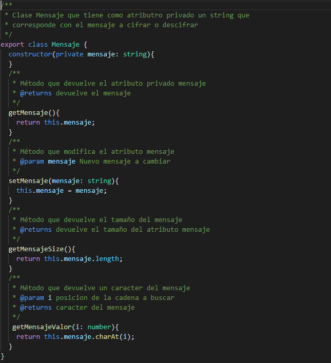

La clase **Mensaje** recibe un string que va a ser el mensaje que utilizará posteriormente la clase **Cifrado**. Además, entre sus métodos se encuentra:

* **getMensaje** y **setMensaje** para mostrar o modificar el string del mensaje.
* **getMensajeSize** para devolver el valor del tamaño del mensaje.
* **getMensajeValor** para devolver un valor en concreto del string mensaje.

#### Clase Clave
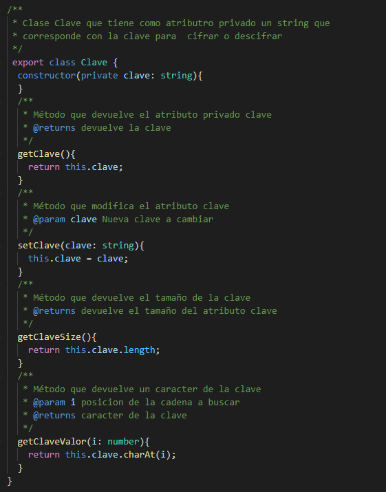

La clase **Clave** recibe un string que va a ser la Clave que utilizará posteriormente la clase **Cifrado**. Además, entre sus métodos se encuentra:

* **getClave** y **setClave** para mostrar o modificar el string de la Clave.
* **getClaveSize** para devolver el valor del tamaño de la Clave.
* **getClaveValor** para devolver un valor en concreto del string clave.

#### Clase Cifrado
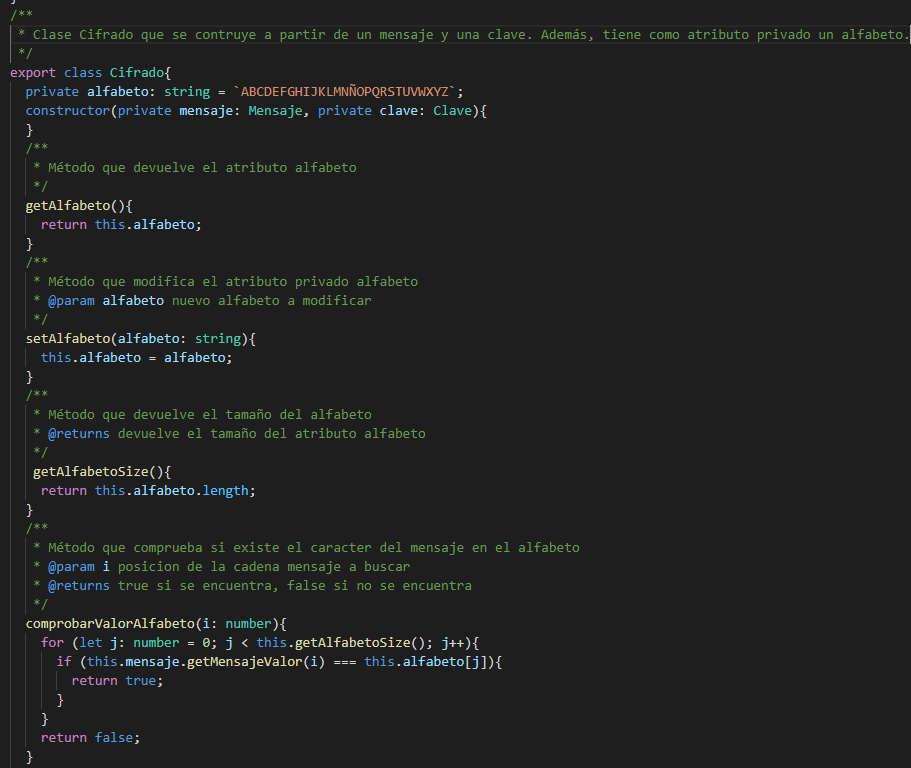

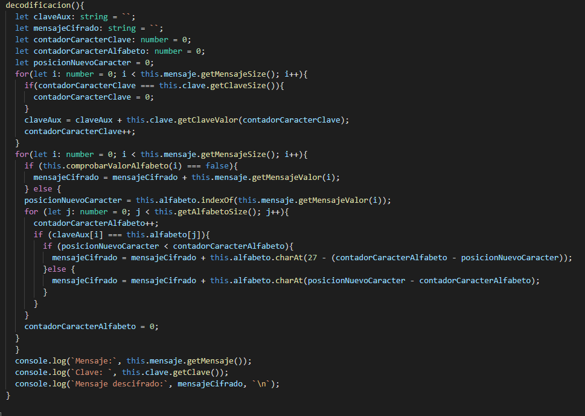

La clase **Cifrado** tiene como atributo privado a **alfabeto**, el cual es un string con todas las letras del abecedario el cual se usará cifrar o descifrar el mensaje.
Entre los métodos de la clase se encuentra:
* **getAlfabeto** y **setAlfabeto** para mostrar o modificar el string del alfabeto.
* **getAlfabetoSize** para devolver el valor del tamaño del alfabeto.
* **comprobarValorAlfabeto** método que comprueba si un caracter en concreto del mensaje esta contenido entre los caracteres del alfabeto.
* **codificacion** y **decodificacion** como métodos principales.

EN el método **codificación**. Primero se crean variables auxiliares entre las que se encuentra: 
* **claveAux** para almacenar una clave del mismo tamaño que el string mensaje.
* **mensajeCifrado** sera el string final que almacenará el string Cifrado.
* **contadorCaracterClave** contador que se usa para introducir en **claveAux** el caracter correspondiente a su valor y que cuando llegue a valer lo mismo que el tamaño del string clave, vuelva a valer 0.
* **contadorCaracterAlfabeto** para almacenar la posicion del caracter de la clave dentro del alfabeto.
* **posicionNuevoCaracter** para almacenar la posicion dentro del alfabeto correspondinete con el caracter que se busca cifrar.

El método comienza con un bucle **for** que recorre el tamaño del mensaje para rellenar la variable **claveAux** y tenga el mismo tamaño que el mensaje y este formada por concatenaciones de la palabra que se almacena en el string **clave**.
Después, se realiza otro bulce **for** tantas veces como tamaño del mensaje. Si el método **comprobarValorAlfabeto** devuelve false, se inserta en **mensajeCifrado** el caracter correspondiente del mensaje. Esto quiere decir que el caracter en cuestión no se encuentra dentro del alfabeto.
Si la anterior condición no se cumple, **posicionNuevoCaracter** almacena la posicion dentro del alfabeto correspondinete con el caracter que se busca cifrar y se realiza otro bucle **for** buscando el caracter de **claveAux** en el alfabeto. Si se encuentra el caracter, entonces se pregunta si la suma **posicionNuevoCaracter y contadorCaracterAlfabeto** es mayor o igual a 27 (debido al tamaño de un alfabeto), si esto es positivo, en **mensajeCifrado** se concatena el caracter del alfabeto que se encuentre en la posicion de la suma de **posicionNuevoCaracter y contadorCaracterAlfabeto** menos 27. En caso contrario en **mensajeCifrado** se concatena el caracter del alfabeto que se encuentre en la posicion de la suma de **posicionNuevoCaracter y contadorCaracterAlfabeto**.
Finalmnete en **mensajeCifrado** queda el mensaje cifrado que se queria obtener.

Para el caso del descifrado, el algoritmo es el mismo, con la diferencia de que no se pregunta si la suma de **posicionNuevoCaracter y contadorCaracterAlfabeto** menos 27, se pregunta si **posicionNuevoCaracter < contadorCaracterAlfabeto**. En caso afirtmativo, en **mensajeCifrado** se concatena el caracter del alfabeto que se encuentre en la posicion 27 menos la resta de **posicionNuevoCaracter y contadorCaracterAlfabeto**. En caso negativo, n **mensajeCifrado** se concatena el caracter del alfabeto que se encuentre en la posicion de restar **posicionNuevoCaracter y contadorCaracterAlfabeto**.

#### Objetos y llamadas a métodos
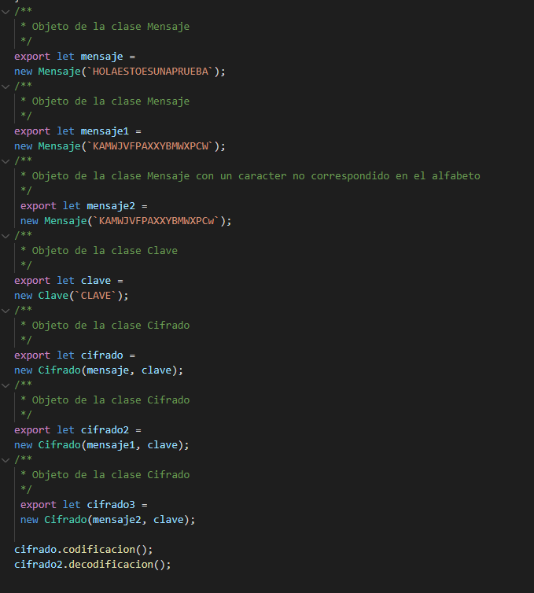

### Resultados

### Test Unitario
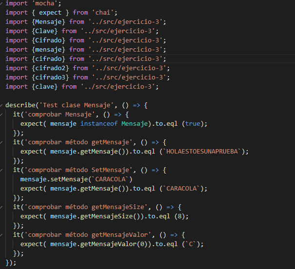

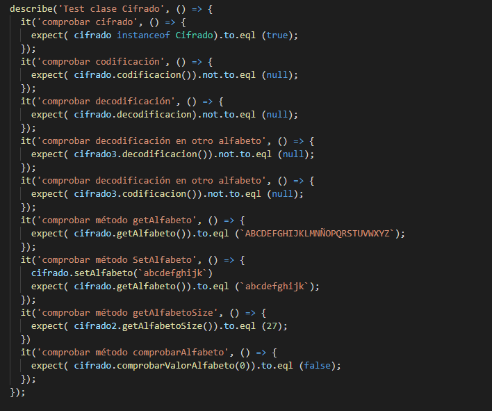

### Demostración Test Unitario

### Coverage

