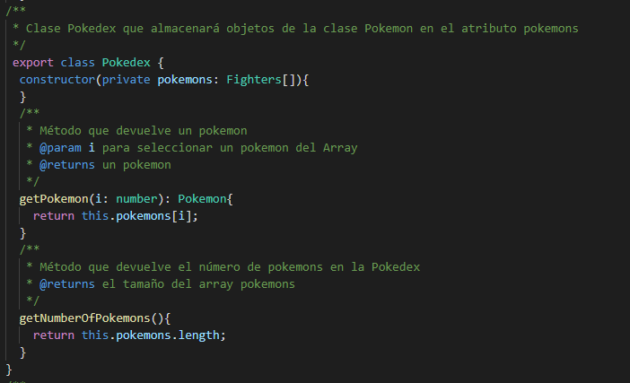
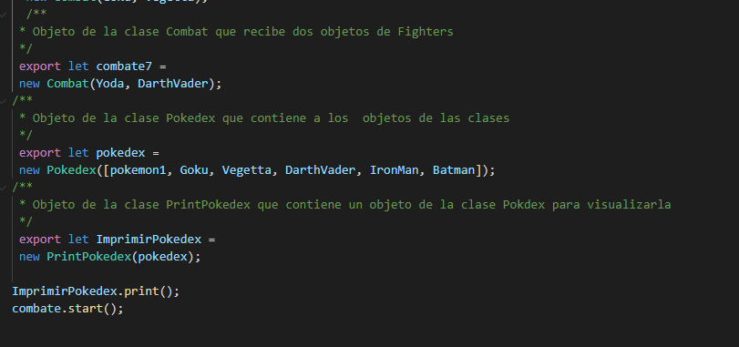
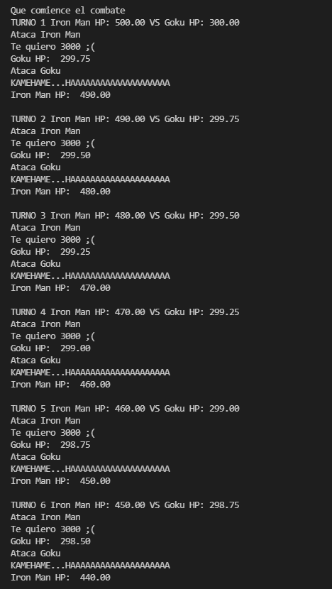
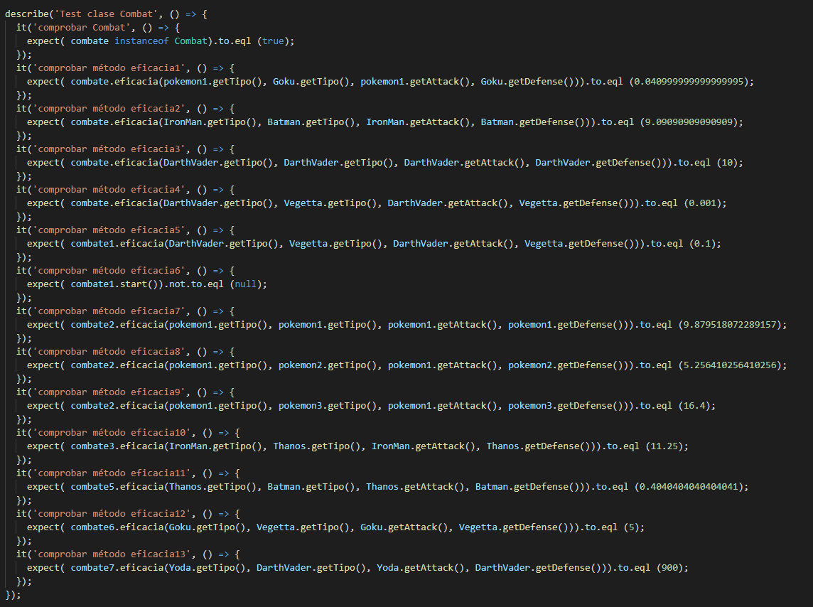
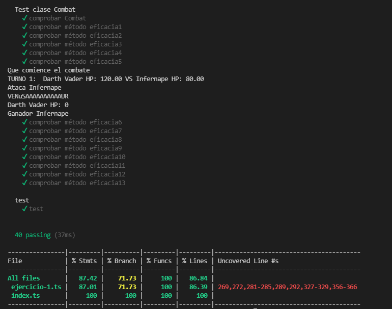

# Informe de la actividad
Práctica que permite conocer más en profundidad las clases e interfaces genéricas del lenguaje TypeScript. Además, se practicará con los principios SOLID de diseño orientado a objetos.

## Ejercicio 1 - El combate definitivo
El objetivo de este ejercicio es, a partir del ejercicio 1 de la práctica 5, añadir una clase abstracta Fighters que sirva de guía pra crear clases de distintos univeros. Y actualizar las clases para que funcionen para cada universo.

### Estructura
Para el siguiente ejercicio se preparó la clase abstracta **Fighters** con todos los métodos privadosque antiguamente teniamos en la clase **Pokemon** y se crearon clases para los universos **Pokemon**, **DragonBall**, **Marvel**, **DC** y **Starwars**. Además de modificar la clase **Pokedex** para que ahora reconozca personajes de clase **Fighters**, se creo con la intención de respetar los principios SOLID, una clase **PrintPokedex** que se encarga simplemente de visualizar la Pokedex. En cuanto a la clase **Combat** se han añadido más condiciones en el método **eficacia** para distinguir situaciones dependiendo del universo.

### Código
#### Clase Fighters

La clase **Fighters** tiene los siguientes atributos privados:
* **nombre** almacena el nombre del luchador.
* **peso** almacena el peso del luchador.
* **altura** almacena la altura del luchador.
* **tipo** almacena como array de string el tipo de un luchador.
* **estadisticas** almacena como array de number la vida, el ataque, la defensa y la velocidad del luchador.

Además de los **get** y **set** de cada atributo, también se añadieron los **get** y **set** para las estadisticas vida, ataque, defensa y velocidad.

#### Clases de los distintos universos

Estas clases son heredadas de la clase abstracta **Fighters**.

#### Clase Pokedex

La clase **Pokedex** tiene como atributo privado **pokemons**, que corresponde con un array del tipo de clase **Fighters**.
Los tres métodos que contiene la clase son:
* **getPokemon** para devolver un luchador en concreto de el array **pokemons**.
* **getNumberOfPokemons** para devolver el tamaño del array **pokemons** y asi saber cuantos luchadores hay en la Pokedex.

#### Clase PrintPokedex

Esta clase contiene el método **print** para visualizar la información de los luchadores.

El método **print** realiza un bucle **for** llamando al método **getNumberOfPokemons** y asi realizar tantas iteraciones como luchadores en la Pokedex. En dicho bucle, se va llamando en cada iteración al método **getPokemon** y al método **get** de cada atributo y estadistica de la clase **Fighters**.

#### Clase Combat

La clase **Combat** sigue siendo igual que en el ejercicio anterior, con la diferencia en el método **eficacia**, en el que se incluyen mas condicionales, y dependiendo de si el objeto es una clase u otra, tome un condicional u otro. Por ejemplo, si ambos objetos son de la clase **Marvel** entran en un condicional y dependiendo de si son heroes o villanos tienen un daño distinto.

#### Objetos y llamadas a métodos

Para el cumplimiento más exhaustivo de la herramienta **Coveralls**, se crearon muchos objetos con la intención de cubrir la mayor cantidad de código.

### Resultados
#### Resultado Pokedex

#### Resultado Combate

### Test Unitario

Test donde se ha llevado a cabo comprobaciones para todas las clases y todos los métodos intentando cubrir la mayor cantidad de código.

### Demostración Test Unitario

